docker コマンドについてまとめる。とりあえず、すぐに必要そうなものだけ。

## 3.1. docker コマンドについて

### 3.1.1 登場する用語のイメージ

```mermaid
architecture-beta
    group ImageRegistry(cloud)[Image registry]
        service image(database)[image] in ImageRegistry

    service trashcan1(x)[Trashcan]

    group Pc(server)[Developer PC]
        service dockerFile(disk)[docker file] in Pc
        service imagex(database)[pulled image or built image] in Pc
        dockerFile:R -[build]-> L:imagex
        image:B -[pull]-> T:imagex
        imagex:B -[rm]-> T:trashcan1

        group Container(server)[Container] in Pc
            service created(server)[Container status is Created] in Container
            service up(server)[Container status is Up] in Container
            service exited(server)[Container status is Exited] in Container
            imagex:R -[run or exec]-> L:created
            created:R -[start]-> L:up
            up:R <-[stop or start]-> L:exited

    service trashcan2(x)[Trashcan]
    exited:B -[rm]-> T:trashcan2
```



### 3.1.2. `docker image` コマンドについて

| コマンド | 効力 |
| --- | --- |
| `docker image pull {イメージ名}` | イメージをダウンロードする。 |
| `docker image ls` | ローカル環境に存在するイメージ一覧を表示する。 |
| `docker image rm {イメージ名}` | 指定したイメージ一を削除する。 |

### 3.1.3. `docker container` コマンドについて

| コマンド | 効力 |
| --- | --- |
| `docker container run {イメージ名}` | 指定したイメージからコンテナを作成し、コンテナを起動し、予約されたコマンドを実行してコンテナを終了する。 |
| `docker container ls` | 起動中のコンテナ一覧を表示する。 `-a` オプションを付与すると、起動していないコンテナも一覧に表示する。 |
| `docker container start {コンテナ名}` | 指定したコンテナを開始する（ステータス: Up にする。） |
| `docker container stop {コンテナ名}` | 指定したコンテナを停止する（ステータス: Exited にする。） |
| `docker container restart {コンテナ名}` | 指定したコンテナを再起動する（ステータス: Up にする。） |
| `docker container exec {コンテナ名} {コマンド}` | 指定した実行中のコンテナで指定したコマンドを実行する。コンテナが実行中でない場合は開始する（はず。） |

`docker container exec` コマンドに指定するオプションのうち、良く使うものは以下の通り。

| 短縮形式 | ロング形式 | 説明 |
| --- | --- | --- |
| -i | --interactive | コンテナの標準入力を開いたままにする。ユーザー入力を受け付ける。 |
| -t | --tty | 擬似端末（仮想ターミナル）を割り当てる。 bash などを快適に使える。 |
| -it | --interactive --tty | 両方を同時に指定（対話的シェル用。） |
| -v | --volume | ホストのディレクトリをコンテナと共有するボリュームとして（ディレクトリ）を割り当てる。 |
| （なし） | --user | ユーザー名を指定する。 |

実行例は以下の通り。

```shell
docker container exec -it --user root ubuntu bash
```

`docker container run` コマンドに指定するオプションのうち、良く使うものは以下の通り。

| 短縮形式 | ロング形式 | 説明 |
| --- | --- | --- |
| -d | --detach | コンテナをバックグラウンドで実行する。 |
| -v | --volume | ホストのディレクトリをコンテナと共有するボリュームとして（ディレクトリ）を割り当てる。 |
