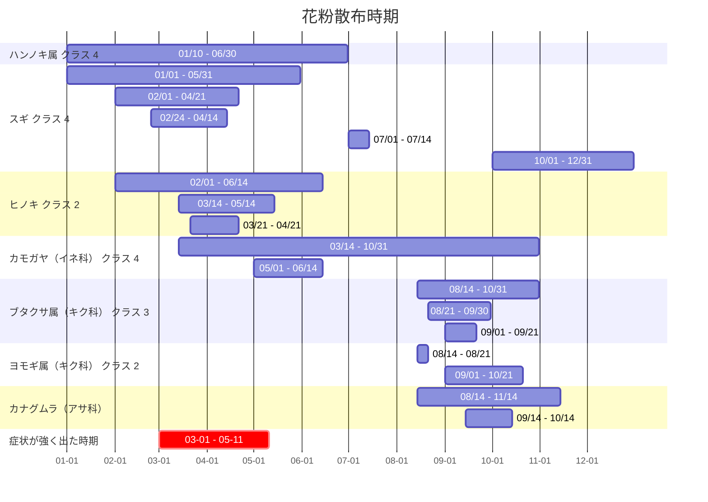

花粉症飛散時期に関するメモ。

```mermaid
gantt
  title 花粉散布時期
  dateFormat YYYY-MM-DD
  axisFormat %m-%d
  todayMarker off
  section ハンノキ属 クラス 4
    01/10 - 06/30: 2025-01-01, 2025-06-30
  section スギ クラス 4
    01/01 - 05/31: 2025-01-01, 2025-05-31
    02/01 - 04/21: 2025-02-01, 2025-04-21
    02/24 - 04/14: 2025-02-24, 2025-04-14
    07/01 - 07/14: 2025-07/01, 2025-07-14
    10/01 - 12/31: 2025-10-01, 2025-12-31
  section ヒノキ クラス 2
    02/01 - 06/14: 2025-02-01, 2025-06-14
    03/14 - 05/14: 2025-03-14, 2025-05-14
    03/21 - 04/21: 2025-03-21, 2025-04-21
  section シラカンバ（カバノキ属）
  section カモガヤ（イネ科） クラス 4
    03/14 - 10/31: 2025-03-14, 2025-10-31
    05/01 - 06/14: 2025-05-01, 2025-06-14
  section ブタクサ属（キク科） クラス 3
    08/14 - 10/31: 2025-08-14, 2025-10-31
    08/21 - 09/30: 2025-08-21, 2025-09-30
    09/01 - 09/21: 2025-09-01, 2025-09-21
  section ヨモギ属（キク科） クラス 2
    08/14 - 08/21: 2025-08-14, 2025-08-21
    09/01 - 10/21: 2025-09-01, 2025-10-21
  section カナグムラ（アサ科）
    08/14 - 11/14: 2025-08-14, 2025-11-14
    09/14 - 10/14: 2025-09-14, 2025-10-14
  section 症状が強く出た時期
    03-01 - 05-11: crit, 2025-03-01, 2025-05-11
```
